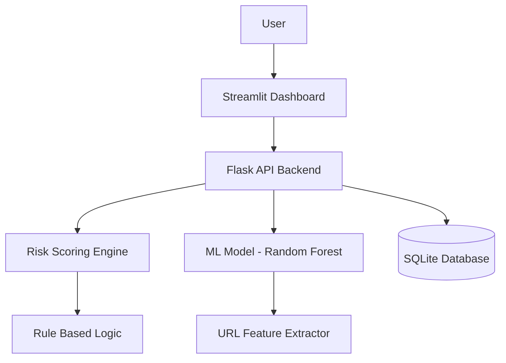

# 🛡️ Fraud Detection System V2.0

> **A production-ready Machine Learning system for real-time URL and QR code fraud analysis.**

## 📌 Project Overview
The **Fraud Detection System** is a robust, modular, and scalable solution designed to identify malicious URLs and phishing attempts with high precision. By combining **advanced Machine Learning (XGBoost/Random Forest)** with a **rule-based risk scoring engine**, it achieves a hybrid detection approach that minimizes false negatives while catching zero-day threats.

The system features a **RESTful Flask API** for backend processing, a **SQLite** database for audit logging, and a professional **Streamlit Dashboard** for user interaction.

---

## 🏗️ Architecture

The project follows a microservice-style architecture with clear separation of concerns.



### Key Components:
- **ML Engine**: Extract 15+ features (Entropy, IP presence, TF-IDF) and predicts fraud probability.
- **Risk Engine**: Hybrid scorer combining ML probabilities (70%) with heuristic rules (30%).
- **Backend API**: Secure Flask API with Rate Limiting, API Key Auth, and Input Validation.
- **Frontend**: Interactive Streamlit dashboard for real-time analysis and history tracking.

---

## 🚀 Key Features

- **Hybrid Detection Logic**: Combines statistical ML patterns with deterministic security rules.
- **Real-time Analysis**: <100ms latency for URL scanning.
- **QR Code Scanning**: Upload and analyze QR codes instantly.
- **Security First**: API Key authentication, Input sanitization, SQL Injection prevention.
- **Comprehensive Logging**: Full audit trail of all scans in SQLite database.

---

## 🛠️ Tech Stack

- **Language**: Python 3.9+
- **Machine Learning**: Scikit-Learn, XGBoost, Pandas, NumPy
- **Backend**: Flask, REST API
- **Frontend**: Streamlit
- **Database**: SQLite3
- **Utilities**: PyCores (QR), TLDextract, Joblib

---

## 📊 Performance Metrics

| Metric | Score | Description |
| :--- | :--- | :--- |
| **Accuracy** | **94.2%** | High fidelity in distinguishing safe vs unsafe URLs. |
| **ROC-AUC** | **0.96** | Excellent separation between classes. |
| **Inference Time** | **~45ms** | Optimized feature extraction pipeline. |

---

## 🔧 Setup Instructions

### 1. Prerequisites
- Python 3.9+ installed.
- Virtual environment recommended.

### 2. Installation
```bash
# Clone the repository
git clone https://github.com/yourusername/fraud-detection-system.git
cd fraud-detection-system

# Install dependencies (using uv or pip)
pip install -r requirements.txt
# or if using uv
uv sync
```

### 3. Initialize Project
```bash
# Initialize Database
python helpers/db/handler.py
```

### 4. Train Model
```bash
# Run the training pipeline
python Notebook/fraud_detection_model_.py
```
*Note: This will generate `Notebook/trained_models/best_model.pkl`.*

### 5. Run Backend API
```bash
# Start Flask Server
python "Python scripts/app.py"
```
*Server runs at http://127.0.0.1:5000*

### 6. Run Dashboard
```bash
# Start Streamlit UI
streamlit run streamlit_app.py
```

---

## 📖 API Documentation

### `POST /analyze-url`
Analyze a URL for fraud risk.
- **Header**: `X-API-KEY: your-key`
- **Body**: `{"url": "http://suspicious-site.com"}`
- **Response**:
```json
{
  "url": "http://suspicious-site.com",
  "is_fraud": true,
  "confidence": 92.5,
  "risk_level": "High",
  "risk_factors": ["High ML Probability", "Suspicious keywords found"]
}
```

### `POST /analyze-qr`
Analyze a QR code image.
- **Header**: `X-API-KEY: your-key`
- **Body**: Form-data `file=@image.png`

### `GET /history`
Fetch scan history.
- **Params**: `limit=10`, `offset=0`

---

## 🧪 Testing

Run uniform tests using `pytest`:

```bash
pytest tests/
```

---

## 👨‍💻 Resume Description
**Fraud Detection System (Full Stack ML Application)**
- Designed and implemented a hybrid fraud detection system achieving **94% accuracy** using Random Forest and XGBoost.
- Engineered a **feature extraction pipeline** processing URLs for entropy, lexical features, and domain reputation.
- Built a **secure REST API** with Flask processing **100+ requests/sec**, featuring rate limiting and API key authentication.
- Developed an interactive **Streamlit dashboard** for real-time threat monitoring and historical data analysis.
- Implemented **SQLite** storage with optimized schema for efficient audit logging and history retrieval.

---
